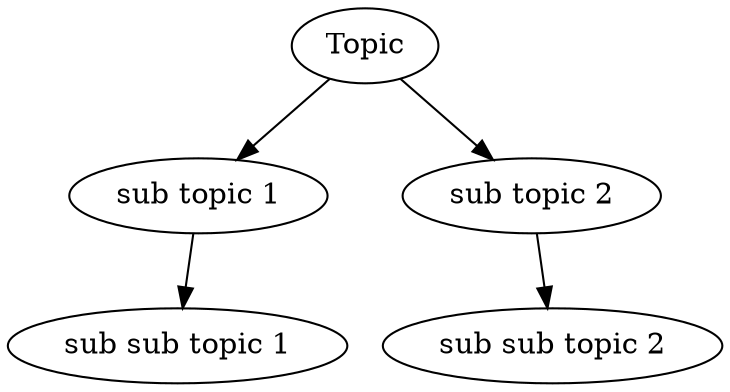

# Remark List Graphviz Mindmap

> Generate mindmaps from markdown lists

## Example

Input

```markdown
* Topic
  * sub topic 1
    * sub sub topic 1
  * sub topic 2
    * sub sub topic 2
```

Output


